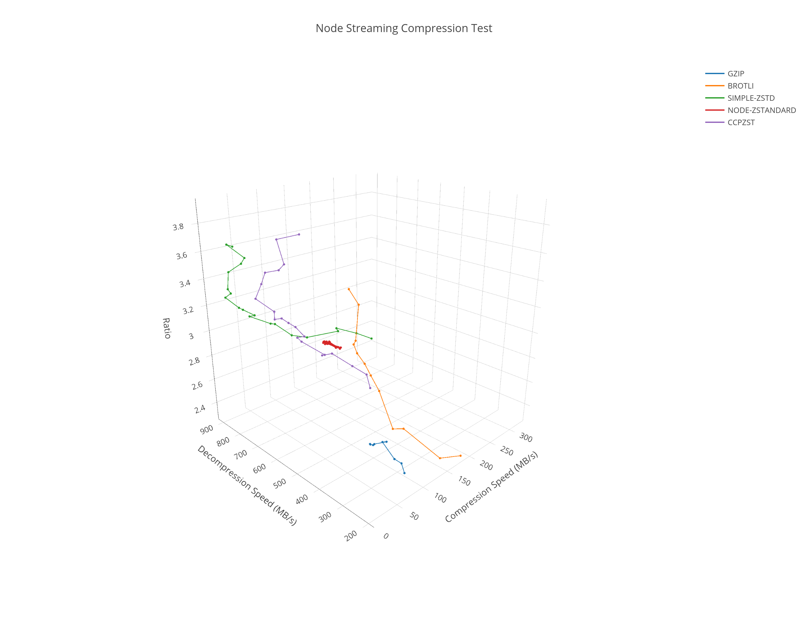
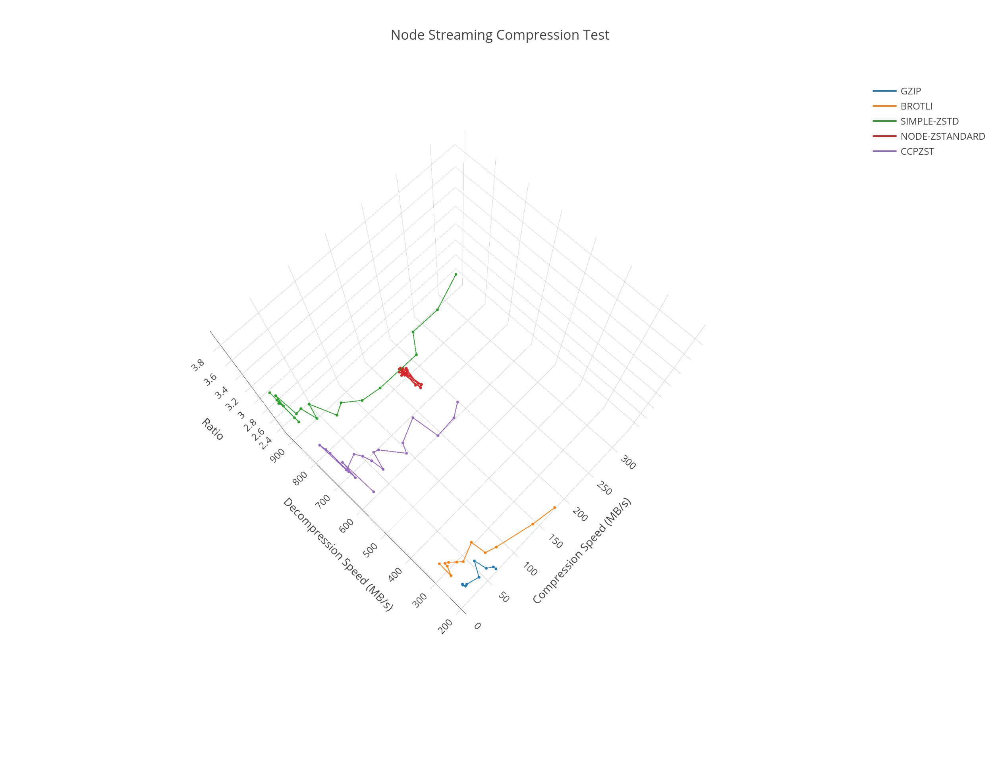

# Node Compression Test

A test of various compressions algorithms and packages in node.

## Why

After experimenting with different zstd packages I wanted to compare their performance of taring and compressing a folder.

## Packages

### GZIP

- zlib - https://nodejs.org/api/zlib.html

### Brotli

- zlib - https://nodejs.org/api/zlib.html

### ZSTD

- simple-zstd - https://www.npmjs.com/package/simple-zstd
- https://www.npmjs.com/package/node-zstandard 
- @xingrz/cppzst - https://www.npmjs.com/package/@xingrz/cppzst (Appears to be the newest of cppzst heritage)

#### No Stream Interface

These packages did not offer a nodejs stream interface.

- https://www.npmjs.com/package/zstd.ts
- https://www.npmjs.com/package/@oneidentity/zstd-js
- https://www.npmjs.com/package/@mongodb-js/zstd

#### Uninstalled Packages

Several packages that rely on a nodejs binding failed to install.

- zstd - https://www.npmjs.com/package/zstd (FAILED TO INSTALL)
- node-zstd - https://www.npmjs.com/package/node-zstd (FAILED TO INSTALL)
- node-zstd - https://www.npmjs.com/package/node-zstd2 (FAILED TO INSTALL)

## Test

[http://www.mattmahoney.net/dc/textdata.html](http://www.mattmahoney.net/dc/textdata.html) enwiki8 was used.

Ubuntu 20.04
Node v18.7.0
AMD Ryzen 5 5600X

## Results

## Conclusions

- simple-zstd sees at minimum ~20% reduction in total time in comparison to cppzst.
- simple-zstd time improvement is during compression.
- node-zstandard is not responding to different level requests.

## License

MIT
